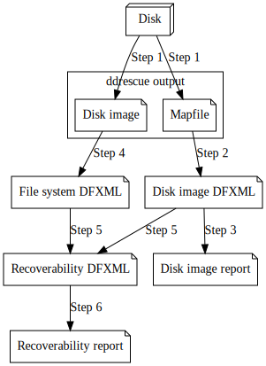

# ddrescue Mapfile to DFXML

This repository implements a converter for [GNU ddrescue](https://www.gnu.org/software/ddrescue/)'s [mapfile](https://www.gnu.org/software/ddrescue/manual/ddrescue_manual.html#Mapfile-structure).  In short, the mapfile is a log of the results of trying to read data regions from a storage medium into a disk image file.  This repository translates that log file into a [DFXML](https://github.com/dfxml-working-group/dfxml_schema/) document, using the `byte_runs` list of a `diskimageobject` element to represent regions that were and were not copied into the disk image file.

The primary command supplied by this repository is [`gddrescue_mapfile_to_dfxml`](gddrescue_mapfile_to_dfxml/cli.py).

Development and testing is example-driven.  The mapfile parsing was written based on available samples, some of which are provided as test data.

Feedback is welcome, as are [contributions](CONTRIBUTE.md).

## Disclaimer

The views and opinions expressed in this project are those of the authors and do not necessarily reflect the official policy or position of any agency of the U.S. government. Any mention of a vendor or product is not an endorsement or recommendation. Logos and trademarks are copyright their respective owners.

## Workflow illustration

This repository is scoped to supporting the following general form of workflow, which starts with a disk image and ends with a report of how damaged regions of the original disk affect the imaged file system.
1. Starting with a disk, take an image with `ddrescue`.  This produces a disk image, which may be incomplete, and a mapfile reporting imaging status.
2. Run `gddrescue_mapfile_to_dfxml` on the mapfile from step 1.  This emits a DFXML file that only summarizes the disk image's geometry, without delving into file systems.
3. A simpler HTML report counting the lost bytes can be generated from the DFXML of step 2, by running [`report_file_recoverability_html.py`](src/report_file_recoverability_html.py).

The above gives a simple summary for when a full file system analysis is not performed.

4. Analyze the file systems of the disk image with a file system parser.  However this process is done, the output would need to be a DFXML file that records file objects with byte runs (denoting addresses of the file's contents on the disk).
5. Run [`make_file_recoverability_dfxml.py`](src/make_file_recoverability_dfxml.py) on the DFXML files from steps 2 and 4.  This emits a DFXML file that only records the files that are not fully readable due to the partial disk imaging.
6. Run [`report_file_recoverability_html.py`](src/report_file_recoverability_html.py) on the DFXML file from step 5.  This will produce an HTML report, an expanded version of what can be made in Step 3.

This figure illustrates the data flow in the above workflow:

### Examples

As part of the tests in this project, example data is provided for some scenarios, and results computed and stored for viewing.  Links to the example results from the workflow above are listed here as well.  (For viewing in a browser, the reports are provided by conversion with `pandoc`.)
* [Multisession CD-ROM](tests/multisession_cd_sample_1/) - This test demonstrates a CD-ROM with audio data, which has known partial-acquisition quirks when some disk imaging tools that work on hard drives are used.
  - Step 1's [mapfile](tests/multisession_cd_sample_1/disk.img.mapfile)
  - Step 2's [disk image DFXML](tests/multisession_cd_sample_1/diskimage.dfxml)
  - Step 3's [disk image report](tests/multisession_cd_sample_1/diskimage.report.md)
* [Damaged disk image](tests/damage_sample_1/) - This test hand-codes a file system that references regions that are in, and not in, a hand-coded disk image map.
  - Step 1's [mapfile](tests/damage_sample_1/damage_sample.img.mapfile)
  - Step 2's [disk image DFXML](tests/damage_sample_1/diskimage.dfxml)
  - Step 3's [disk image report](tests/damage_sample_1/diskimage.report.md)
  - Step 4's [file system DFXML](tests/damage_sample_1/sample_file_system.dfxml), created by a [script](tests/damage_sample_1/sample_file_system_dfxml.py) that hard-coded file information
  - Step 5's [recoverability DFXML](tests/damage_sample_1/file_recoverability.dfxml)
  - Step 6's [recoverability report](tests/damage_sample_1/file_recoverability.report.md)

## Testing and development

Tests are run with `make check`, due to use of file-based test workflows and pre-computed results.

Other Makefile targets are also provided for development convenience:
* `make download` - Retrieve network-dependent files.  After this is run once, the rest of this repository can be used offline.
* `make docs` - Generate documentation.  Requires `pandoc` to translate HTML reports to Github-flavored Markdown.  This step should not be necessary unless Markdown is desired -- the HTML reports are generated by `make check` as part of testing the report-generating script.
* `make check-docs` - (For Github repository maintenance.)  Confirm computed documentation matches Git-tracked documentation.

## Development status

This project currently depends on some publicly available, though not necessarily stable, implementations.

### Dependencies in draft

This repository currently relies on extensions to DFXML 1.2.0, listed in [Schema Issue #36](https://github.com/dfxml-working-group/dfxml_schema/issues/36).  Those are being used in a development branch of DFXML, [`add_disk_image_object_fixity_fields`](https://github.com/ajnelson-nist/dfxml/tree/add_disk_image_object_fixity_fields).

### Supplementary scripts

This repository also has two scripts and a library that *may be migrated* into the [DFXML code base](https://github.com/simsong/dfxml).  They are in this repository at the moment because this is (to the author's knowledge) the only code base generating *DFXML files* for the purpose of analyzing disk imaging errors and their impact.

* [`src/intact_byte_run_index.py`](src/intact_byte_run_index.py) - a class for comparing file geometry (byte run locations) with acquired disk image geometry.
* [`src/make_file_recoverability_dfxml.py`](src/make_file_recoverability_dfxml.py) - a script that identifies files not fully present in an acquired disk image.  Emits a manifest of files as DFXML.
* [`src/report_file_recoverability_html.py`](src/report_file_recoverability_html.py) - a script that 

When a DFXML generator of the same scope as `gddrescue_mapfile_to_dfxml` is written for another tool, the above scripts are likely to migrate.

## Versioning

Where files are versioned, this project follows [Semantic Versioning 2.0.0](https://semver.org/).
